# Two-VM Network Commissioning & Connectivity Verification (OPNsense + Ubuntu)

A from-scratch build of a small protected network using **VirtualBox**, an **OPNsense** firewall VM, and an **Ubuntu** client VM — covering WAN/LAN interface configuration, IPv4 addressing and routing, DNS resolution, and packet-level verification of ARP, ICMP, and DNS traffic in **Wireshark**. Includes a real misconfiguration encountered mid-lab and the diagnostic steps taken to resolve it.

> 🎓 **Context:** WADF105 Network Security Fundamentals lab (ICDFA). Performed entirely inside the authorised two-VM lab environment (`icdfa-nslab-firewall-v1` + `icdfa-nslab-client-v1`) on an isolated VirtualBox Internal Network (`ICDFA-LAN`).

---

## 🎯 Objective

Stand up a minimal firewall-protected network from nothing but blank VM network settings, then **prove** — at every layer — that it works correctly:

- OPNsense correctly separates a WAN (internet-facing, NAT) interface from a LAN (protected, `10.10.10.1/24`) interface
- Ubuntu obtains a valid DHCP lease on the LAN and routes through OPNsense as its default gateway
- Local connectivity, internet connectivity, and DNS resolution are each verified **independently**, layer by layer
- The resulting traffic is captured and visually confirmed in Wireshark (ARP, ICMP, DNS)

## 🧰 Environment & Topology

| VM | Adapter 1 | Adapter 2 | Role |
|---|---|---|---|
| `icdfa-nslab-firewall-v1` (OPNsense) | NAT (WAN) | Internal Network `ICDFA-LAN` (LAN, `10.10.10.1/24`) | Firewall / gateway / DHCP+DNS server for the LAN |
| `icdfa-nslab-client-v1` (Ubuntu) | Internal Network `ICDFA-LAN` only | — | Client workstation and packet-capture host |

```
Internet ── NAT ── [ WAN: em0 ] OPNsense [ LAN: em1, 10.10.10.1/24 ] ── ICDFA-LAN (Internal Network) ── Ubuntu (10.10.10.x)
```

## 🗂️ Repository Structure

```
vm-network-commissioning-report/
├── README.md
└── screenshots/
    ├── 01-virtualbox-firewall-adapter1-nat.png
    ├── 02-virtualbox-firewall-adapter2-icdfa-lan.png
    ├── 03-virtualbox-ubuntu-adapter1-icdfa-lan.png
    ├── 04-opnsense-console-wan-ip-missing-fault.png
    ├── 05-opnsense-reassign-interfaces-step1.png
    ├── 06-opnsense-reassign-interfaces-confirm-wan-em0-lan-em1.png
    ├── 07-opnsense-console-wan-ip-fixed-via-dhcp.png
    ├── 08-ubuntu-ip-address-route-dns-status.png
    ├── 09-ping-gateway-10-10-10-1.png
    ├── 10-ping-internet-1-1-1-1.png
    ├── 11-dns-resolution-and-curl-https-opnsense-org.png
    ├── 12-opnsense-web-dashboard-wan-lan-status.png
    ├── 13-wireshark-arp-request-reply-list.png
    ├── 14-wireshark-arp-frame-encapsulation-detail.png
    ├── 15-wireshark-arp-header-sender-target-detail.png
    ├── 16-wireshark-icmp-echo-request-reply.png
    └── 17-wireshark-dns-query-response-opnsense-org.png
```

Screenshots are numbered in the order the work was performed, with descriptive filenames so each image is self-explanatory in a GitHub repo browser.

---

## 🔧 Part A — VirtualBox Adapter Configuration

With both VMs **fully powered off** (adapter changes must never be made while a VM is running or saved), each adapter was configured exactly as specified:

- **OPNsense Adapter 1** → `NAT` (gives the firewall a path to the internet)
- **OPNsense Adapter 2** → `Internal Network`, named exactly `ICDFA-LAN` (case-sensitive)
- **Ubuntu Adapter 1** → `Internal Network`, named exactly `ICDFA-LAN`

`ICDFA-LAN` acts as a private virtual switch connecting the firewall's LAN side directly to the Ubuntu client — Ubuntu has no path to the internet except through OPNsense.

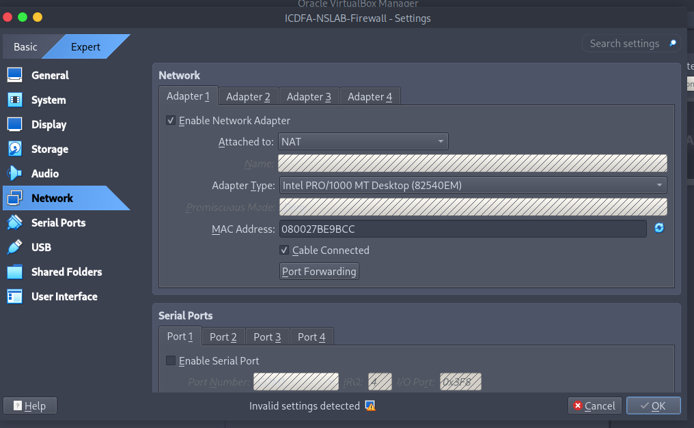
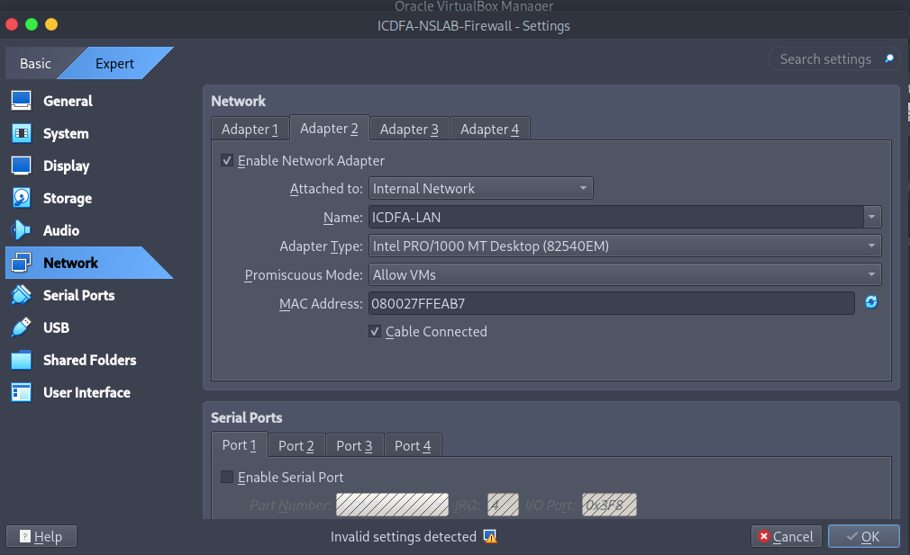
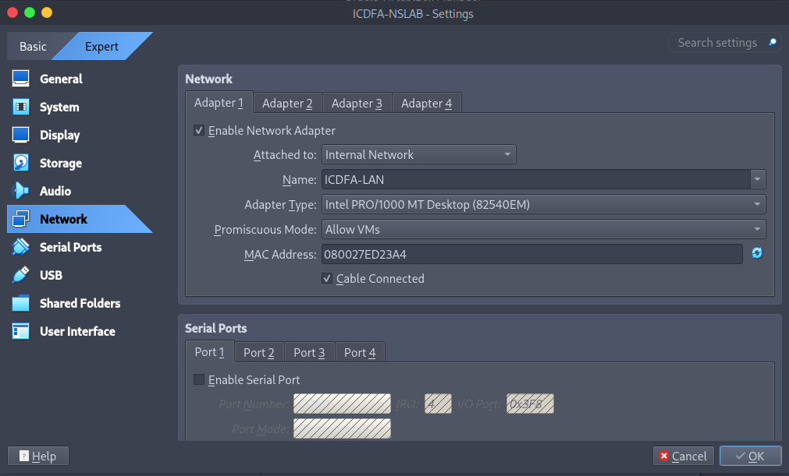

---

## 🩺 Part B — OPNsense Interface Verification (a real fault, found and fixed)

On first boot, the OPNsense console showed the **LAN** interface correctly addressed at `10.10.10.1/24`, but the **WAN** interface had **no IPv4 address at all** — and a `ping 1.1.1.1` from the console failed as a direct result. This is a genuine misconfiguration, not a scripted step, caught by reading the console output carefully rather than assuming the defaults were correct.

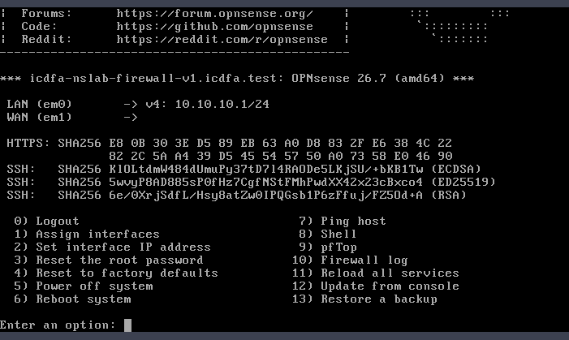

**Diagnosis:** the WAN/LAN interface assignment itself was the suspect — not the adapter wiring in VirtualBox, since LAN was already working correctly on `em1`.

**Fix applied:** used OPNsense console option **1) Assign interfaces** to explicitly re-map the physical adapters, confirming `em0` → WAN and `em1` → LAN before committing the change.

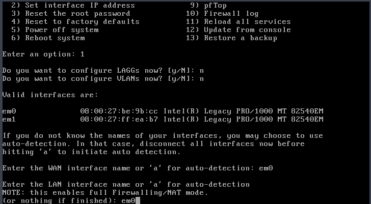
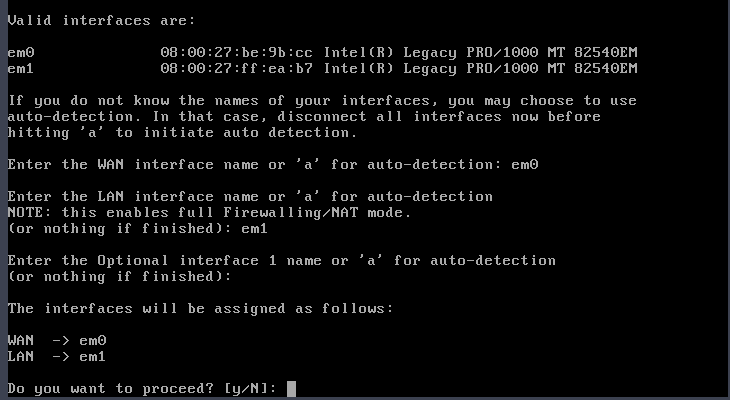

**Result:** after the reassignment, the WAN interface immediately picked up a DHCP4 lease (`10.0.2.15/24`) from VirtualBox's NAT engine, while the LAN interface remained correctly addressed at `10.10.10.1/24`.

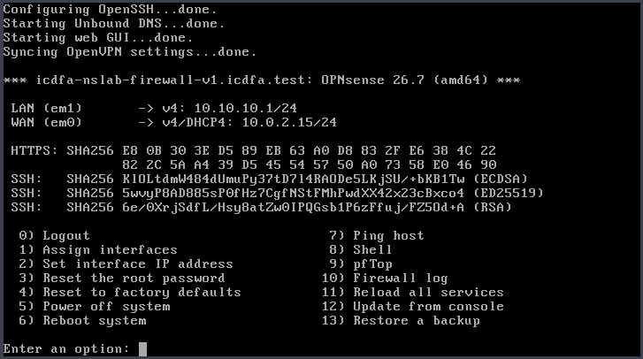

> This is the kind of fault a network administrator should expect in practice: interface *wiring* (VirtualBox adapters) can be correct while interface *assignment* (which physical NIC OPNsense treats as WAN vs LAN) is wrong — and the symptom (no WAN IP, failed outbound ping) points straight at that distinction.

---

## 🖥️ Part C — Ubuntu Addressing Verification

With OPNsense now healthy, Ubuntu was checked independently:

```bash
ip -4 -br address   # enp0s3 → 10.10.10.216/24, UP
ip route             # default via 10.10.10.1 dev enp0s3 proto dhcp
resolvectl status     # Current DNS Server: 10.10.10.1, DNS Domain: icdfa.test
```

This confirms, in one screenshot, all three things a client needs before any application traffic can work: a valid DHCP-assigned IP inside `10.10.10.0/24`, a default route pointing at the firewall's LAN interface, and OPNsense itself (`10.10.10.1`) serving as the DNS resolver.

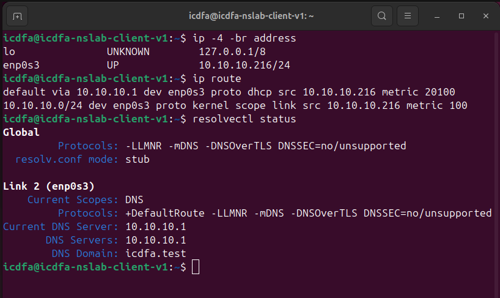

---

## ✅ Part D — Layered Connectivity Testing

Each test below was run **in sequence**, deliberately isolating one layer at a time rather than jumping straight to an internet test:

| # | Test | Result | What it proves |
|---|---|---|---|
| 1 | `ping -c 4 10.10.10.1` | 0% loss, ~1.2 ms avg | Ubuntu can reach the firewall's LAN interface (Layer 3 local) |
| 2 | `ping -c 4 1.1.1.1` | 0% loss, ~18 ms avg | Routing + outbound NAT through OPNsense's WAN are working |
| 3 | `getent hosts opnsense.org` | IPv6 address returned | DNS resolution via OPNsense's Unbound resolver works |
| 4 | `curl -I https://opnsense.org` | `HTTP/1.1 200 OK` + headers | TCP, TLS, and full web connectivity confirmed end-to-end |

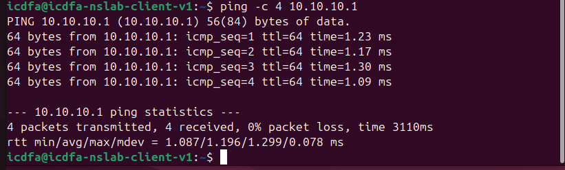
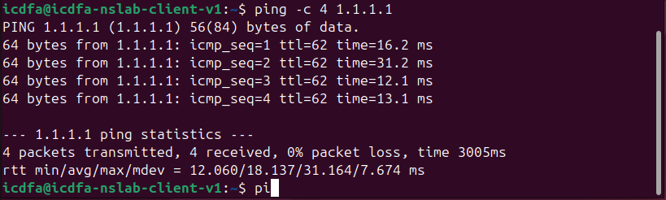
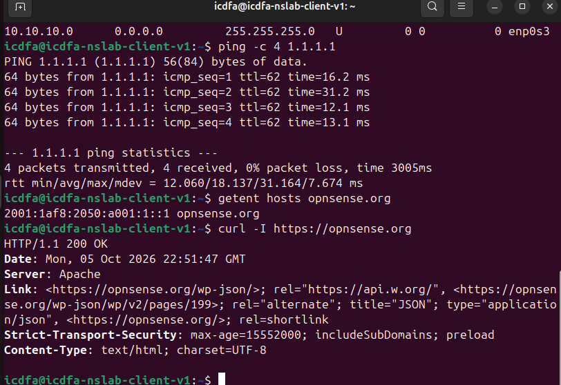

Finally, the OPNsense web GUI was reached directly at `https://10.10.10.1` (self-signed certificate warning accepted, as expected for this authorised local firewall only), confirming the same WAN/LAN addressing from the dashboard: **WAN** `10.0.2.15/24` (DHCP), **LAN** `10.10.10.1/24`.

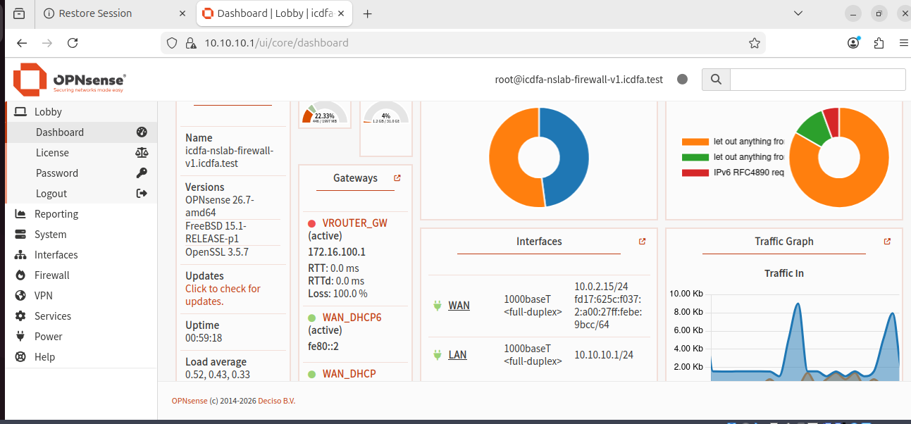

---

## 📡 Part E — Packet-Level Verification in Wireshark

With a capture running on Ubuntu's active interface (`enp0s3`), `ping -c 4 10.10.10.1` and `getent hosts opnsense.org` were re-run, then the capture was filtered and inspected to directly confirm each protocol at the packet level rather than relying on command-line output alone.

**`arp`** — Ubuntu's request for the firewall's MAC address, and OPNsense's reply:

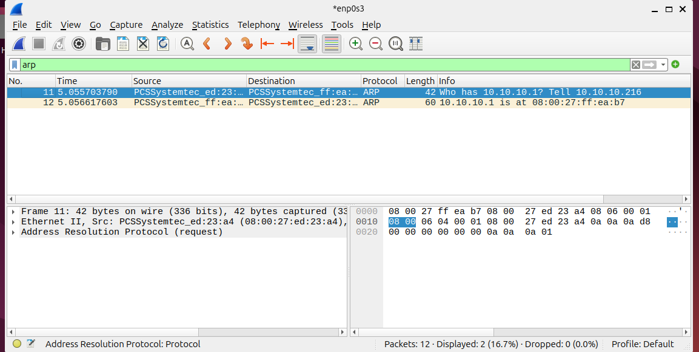
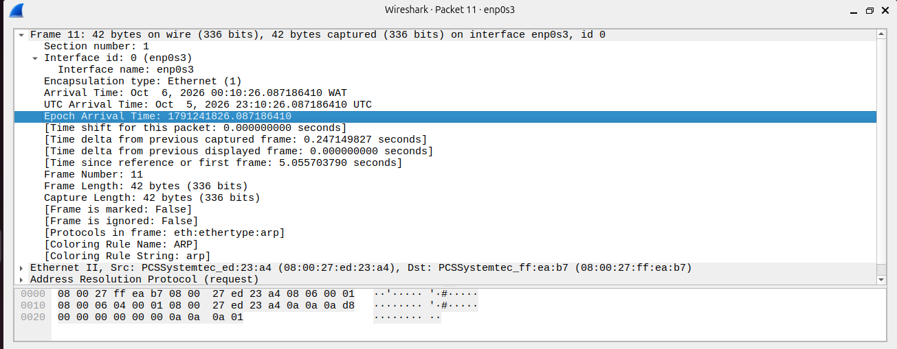
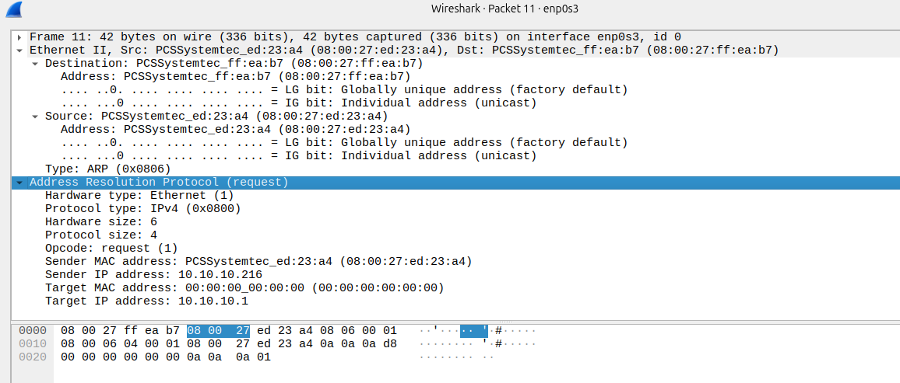

**`icmp`** — four matched echo request/reply pairs to `10.10.10.1`, with the ICMP header (type, code, identifier, sequence number) expanded:

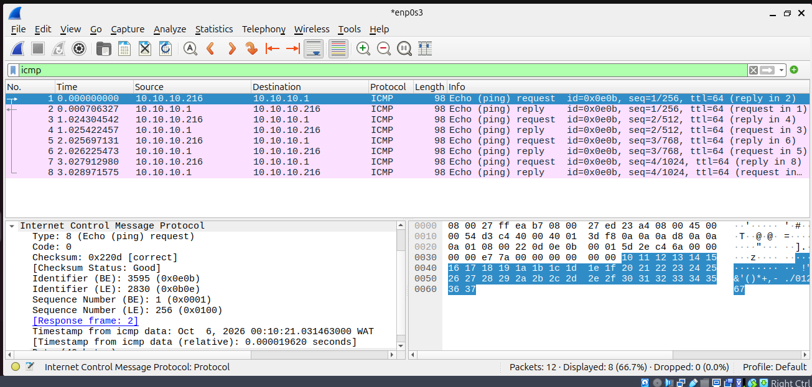

**`dns`** — the AAAA query for `opnsense.org` sent to OPNsense's resolver (`10.10.10.1:53`) and its response, with the UDP/DNS layers expanded:

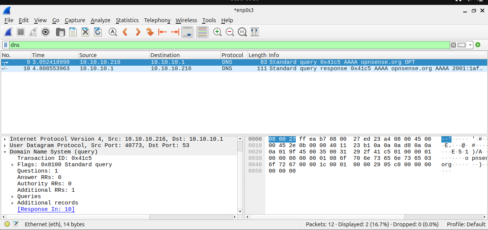

---

## 📝 Why Ubuntu Uses `10.10.10.1` as Its Default Gateway

`icdfa-nslab-client-v1` sits on an isolated VirtualBox **Internal Network** (`ICDFA-LAN`) with no direct path to the internet at all — that adapter type doesn't route anywhere on its own. `10.10.10.1` is the LAN-facing interface of `icdfa-nslab-firewall-v1`, the only device bridging that isolated segment to a real network path (via its separate NAT-attached WAN interface). Every packet Ubuntu sends to any address outside `10.10.10.0/24` is therefore handed to `10.10.10.1` by the kernel's default route, which OPNsense then inspects, firewalls, and forwards (NATed) out through WAN. Without that default gateway entry, Ubuntu could still ARP and reach other hosts on the same `/24`, but would have no way to reach `1.1.1.1` or resolve external DNS at all — exactly the symptom the WAN-misconfiguration fault in Part B would have caused if left unresolved.

---

## 💡 Key Skills Demonstrated

- Correctly wiring a multi-VM isolated lab network in VirtualBox (NAT vs Internal Network, matching network names)
- Reading firewall console output critically enough to catch a real interface-assignment fault instead of assuming defaults are correct
- Diagnosing and resolving the fault using OPNsense's own interface-reassignment workflow
- Verifying a network **layer by layer** (local gateway → internet by IP → DNS → full HTTPS) instead of jumping straight to the end-to-end test
- Reading `ip -4 -br address`, `ip route`, and `resolvectl status` output to confirm addressing, routing, and DNS configuration independently
- Capturing and filtering live traffic in Wireshark (`arp`, `icmp`, `dns`) and explaining each exchange at the packet-field level
- Explaining *why* a specific IP is the correct default gateway in terms of actual network topology, not just repeating a configured value

---

## ⚖️ Disclaimer

This project was completed as part of a supervised cybersecurity/networking training course, entirely within an isolated virtual lab (`ICDFA-LAN`) using instructor-provided firewall and client VM images. It is shared for portfolio/educational purposes to demonstrate practical network commissioning and troubleshooting methodology.
