# OPNsense Firewall Policy Testing, Logging & Packet Analysis

A controlled firewall-policy experiment on the previously commissioned OPNsense + Ubuntu lab network: two narrow, temporary rules were created above the default allow policy to selectively block ICMP and outbound HTTP, their effect was verified from the client, correlated against OPNsense's own logs, cross-checked at the packet level in Wireshark, traced through the live NAT state table, and finally cleanly rolled back to a verified known-good state.

> 🎓 **Context:** WADF105 Network Security Fundamentals lab (ICDFA), built directly on top of the two-VM network commissioned in Lab 1 (`icdfa-nslab-firewall-v1` + `icdfa-nslab-client-v1`, OPNsense LAN `10.10.10.1/24`). All rule changes were made only on this authorised lab firewall and fully reverted at the end of the exercise.

---

## 🎯 Objective

Demonstrate — with evidence from four independent sources (CLI tests, OPNsense Live View logs, Wireshark packet captures, and the OPNsense state table) that agree with each other — a core firewall concept: **specific rules placed above a broad allow rule take effect first**, and that blocking one protocol (ICMP) or one port (TCP/80) does not affect unrelated traffic (DNS, HTTPS) sharing the same path.

## 🗂️ Repository Structure

```
opnsense-policy-logging-report/
├── README.md
└── screenshots/
    ├── 01-baseline-ip-address-route-ping.png
    ├── 02-baseline-curl-http-example-com.png
    ├── ...
    └── 21-restored-curl-https-success.png
```

Screenshots are numbered in the exact order the lab was performed, with descriptive filenames so each image is self-explanatory in a GitHub repo browser.

---

## 🔍 Part A — Baseline (before any rules are added)

Before touching the firewall, every relevant test was run and recorded so later results could be compared against a known-good state — Ubuntu's addressing/routing, a ping to `1.1.1.1`, DNS resolution, and **both** HTTP and HTTPS to the same host, specifically so a later HTTP-only failure could be attributed to the new rule rather than a pre-existing problem.

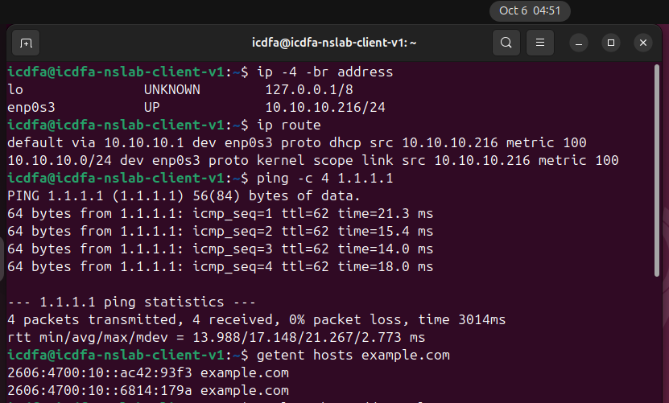
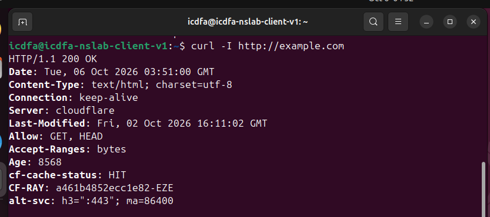
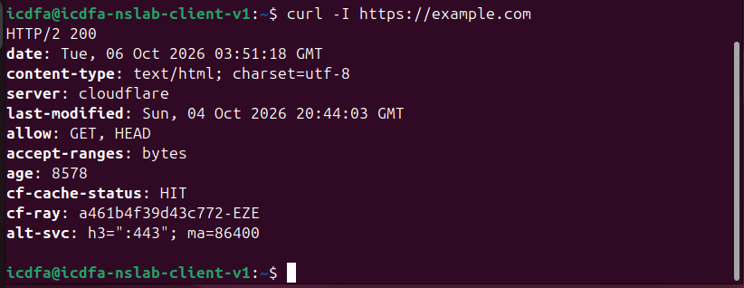

---

## 🧱 Part B — Reviewing Rule Order

Confirmed the existing broad `Default allow LAN to any` rule in **Firewall → Rules → LAN**, and noted that OPNsense evaluates rules **top to bottom, first match wins** — meaning any new restriction has to sit *above* this rule, not below it, or it will simply never be reached.

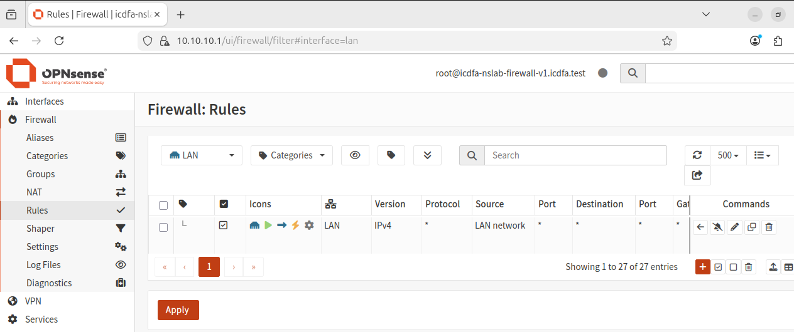

---

## 🚫 Part C — Blocking ICMP to a Single Host

A narrow rule was added — **Block / LAN / In / IPv4 / ICMP / LAN net → 1.1.1.1/32**, logging enabled — and positioned above the default allow rule.

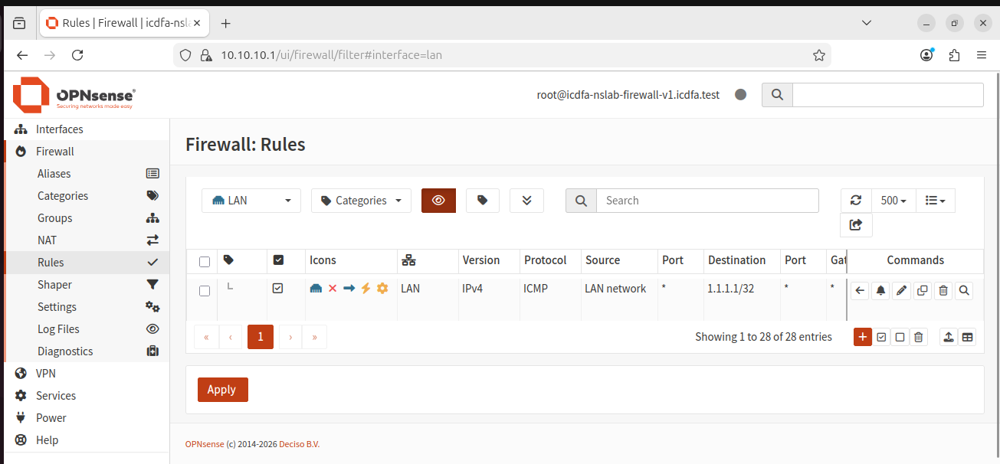

**Result:** `ping -c 4 1.1.1.1` → **100% packet loss**, while `getent hosts example.com` and `curl -I https://example.com` **both still succeeded** in the same test run — direct proof the block is protocol-specific, not a blanket internet outage.

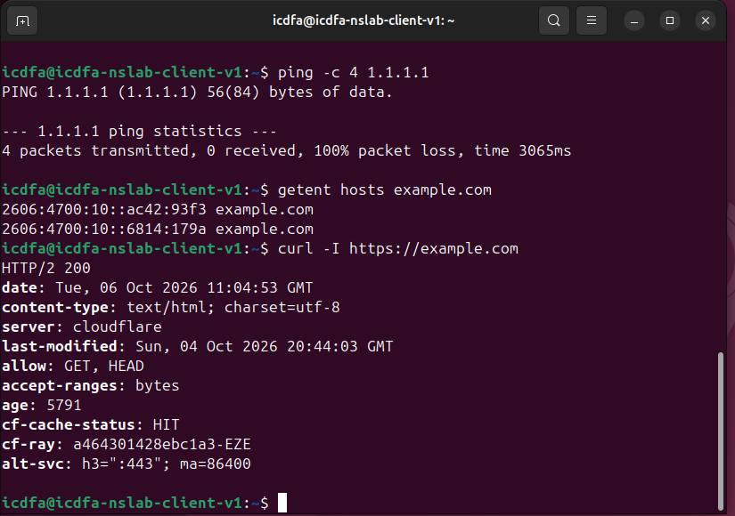

---

## 🚫 Part D — Blocking Outbound HTTP While Allowing HTTPS

A second rule was added — **Block / LAN / In / IPv4 / TCP / LAN net → Any, destination port 80** — again positioned above the default allow rule.

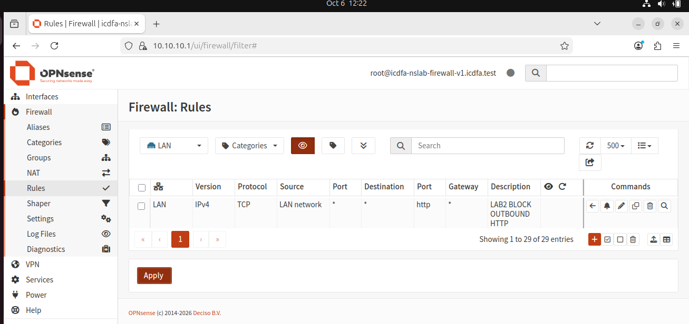

**Result:** `curl --max-time 10 -I http://example.com` **timed out after 10 seconds**, while `curl --max-time 10 -I https://example.com` **returned `HTTP/2 200` immediately** — proving the block is specific to TCP/80, with TCP/443 on the same host completely unaffected.

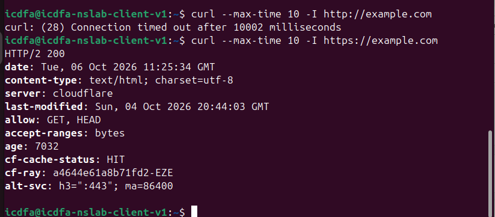

---

## 📋 Part E — Correlating with OPNsense Firewall Logs

**Firewall → Log Files → Live View** was filtered by each rule's description to isolate matching entries, confirming the exact timestamp, source/destination IP, protocol, port, and the specific rule label responsible for each drop.

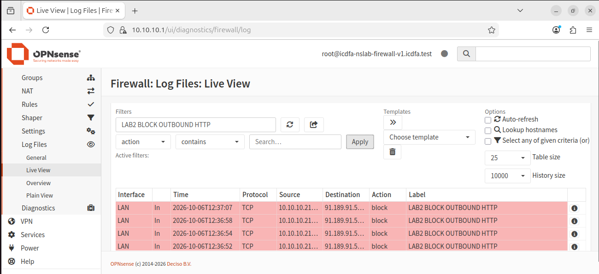
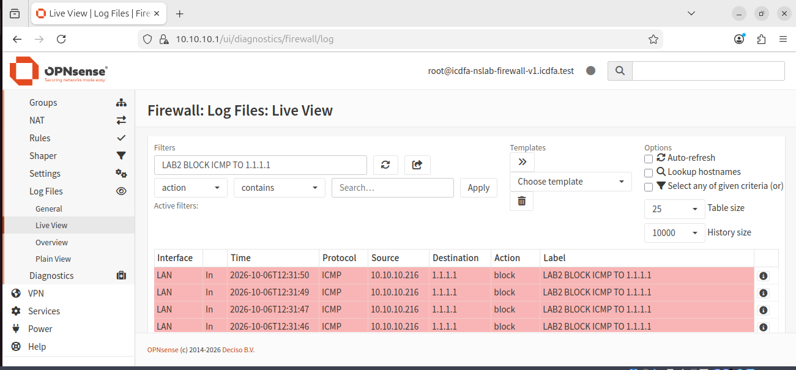

| Field | ICMP Block Rule | HTTP Block Rule |
|---|---|---|
| Timestamp | 2026-10-06T12:31:50 | 2026-10-06T12:37:07 |
| Interface | LAN (em1) | LAN (em1) |
| Source IP | 10.10.10.216 | 10.10.10.216 |
| Destination IP | 1.1.1.1 | 91.189.91.58 |
| Protocol | ICMP | TCP |
| Destination Port | N/A | 80 |
| Action | Block | Block |
| Rule Label | LAB2 BLOCK ICMP TO 1.1.1.1 | LAB2 BLOCK OUTBOUND HTTP |

**Why the traffic matched the block rule and not the default allow rule:** OPNsense evaluates LAN rules sequentially, top to bottom, under first-match semantics. Because both LAB2 rules were positioned above `Default allow LAN to any`, any packet meeting their specific match criteria (ICMP to `1.1.1.1`, or TCP destined for port 80) was blocked immediately — rule evaluation stopped at that point and never reached the broader allow rule beneath it.

---

## 📡 Part F — Correlating with Wireshark

The same tests were re-run while capturing on Ubuntu's active interface, then isolated with three display filters to see exactly how each outcome looks at the packet level:

**`icmp && ip.addr == 1.1.1.1`** — all four echo requests leave Ubuntu; Wireshark marks every one "no response" because OPNsense silently drops them before any reply can return.

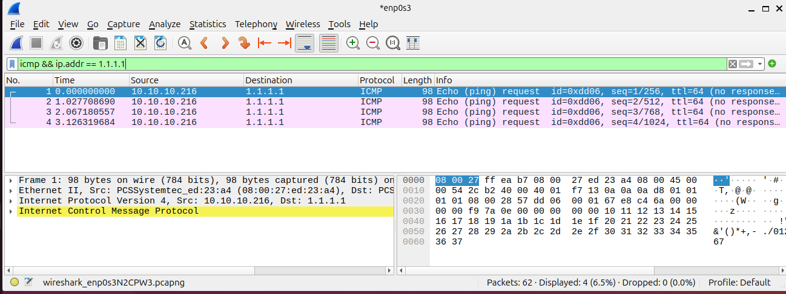

**`tcp.dstport == 80`** — the initial SYN is sent, then **retransmitted repeatedly** with no `SYN, ACK` ever coming back — the classic signature of a silently dropped connection attempt (as opposed to a `RST`, which would indicate an active refusal rather than a firewall drop).

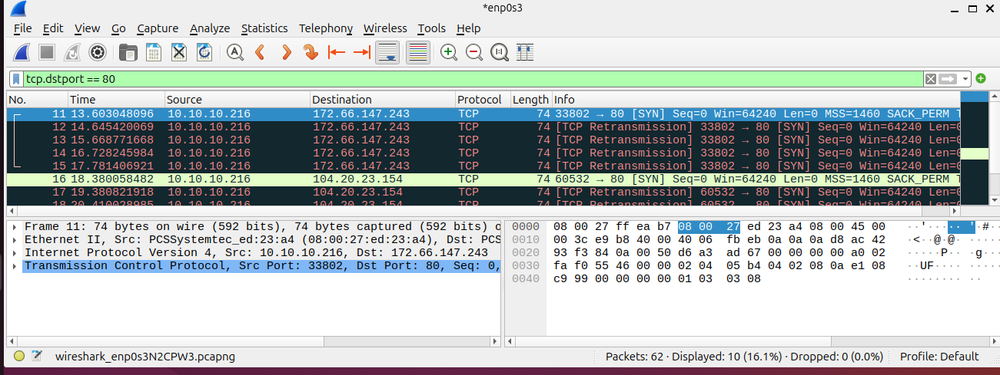

**`tcp.port == 443`** — a fully functioning, acknowledged TLS session with `Application Data` flowing both directions — the clean contrast against the two blocked flows above.

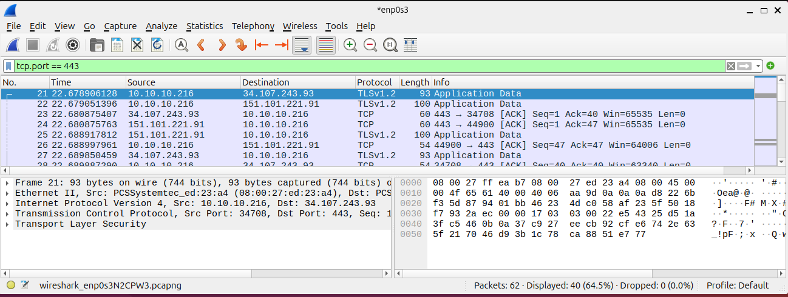

---

## 🔁 Part G — Firewall States & Automatic Outbound NAT

**Firewall → Diagnostics → States**, filtered by the client's IP, shows the live connection table — including a permitted HTTPS connection's LAN-side entry and its separately NAT-translated WAN-side entry (the client's private `10.10.10.x` source address rewritten to the firewall's WAN address before leaving the network).

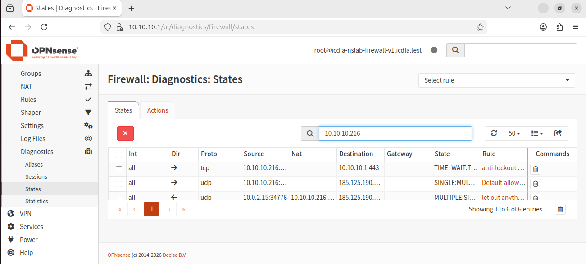
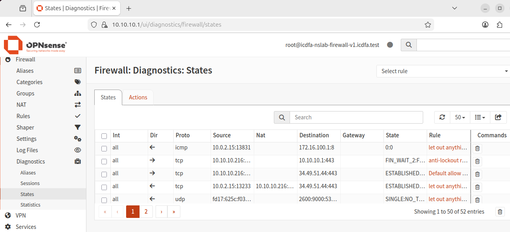

**Firewall → NAT → Outbound** confirms the mode in use: **Automatic Source NAT rule generation**, translating the LAN network's private addresses to the WAN interface address for every outbound connection — left unchanged throughout, as instructed.

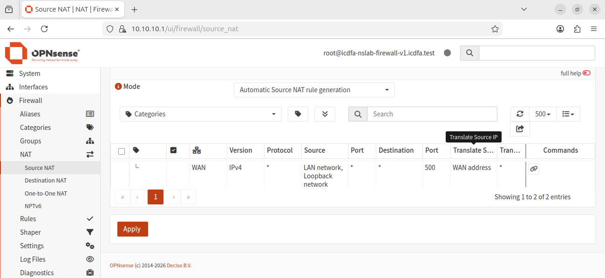

---

## ♻️ Part H — Restoring the Baseline

Both LAB2 rules were **disabled** (not deleted, so the configuration remains available for review) and changes applied.

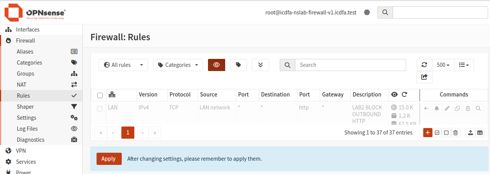
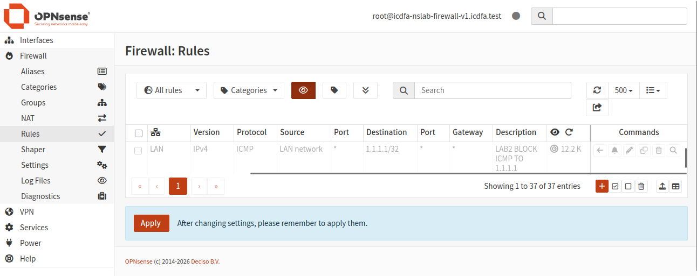

All three original baseline tests were re-run and **all three passed again**, confirming the lab environment was returned to its known-good state before any further work continued.

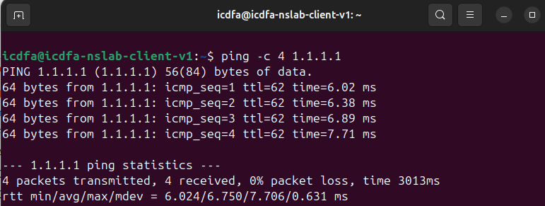
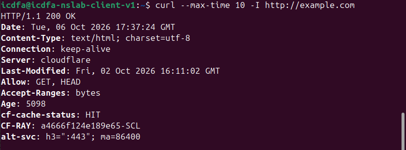
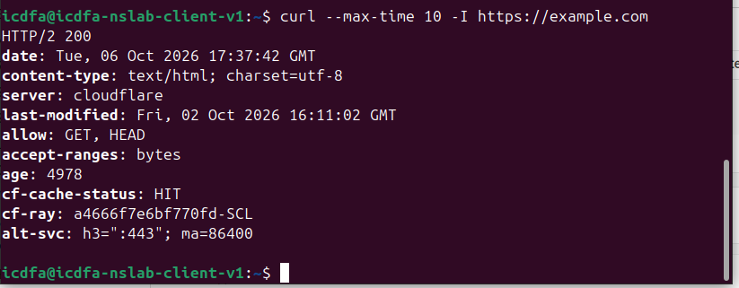

---

## ❓ Analysis Questions & Answers

**Why must specific block rules sit above the broad allow rule?**
OPNsense uses first-match, top-to-bottom rule evaluation. Once a packet matches a rule, that rule's action is applied immediately and evaluation stops. A block rule placed *below* the default allow rule would never be reached — the allow rule would already have matched and passed the traffic.

**Which five packet attributes are most useful when explaining a firewall decision?**
Source IP, destination IP, IP protocol (ICMP/TCP/UDP), destination port (where applicable), and the interface/direction the traffic was evaluated on.

**Why did blocking ICMP not block HTTPS?**
ICMP and TCP are distinct protocols evaluated independently by the firewall. The ICMP rule's match criteria are specific to ICMP traffic only, so TCP/443 traffic was never a candidate for that rule and fell through to the default allow rule untouched.

**What difference did blocked TCP/80 traffic show versus permitted TCP/443 traffic?**
Port 80 showed a SYN sent with no SYN-ACK ever returned, followed by repeated client-side retransmissions until timeout — the signature of a silent drop. Port 443 showed a complete three-way handshake followed immediately by encrypted TLS application data, with no retransmissions.

**What role does outbound NAT play for a private-IP client like `icdfa-nslab-client-v1`?**
`10.10.10.x` addresses are RFC 1918 private space and non-routable on the internet. Outbound NAT rewrites the client's private source address to OPNsense's routable WAN address before the packet leaves, and the firewall's state table tracks the mapping so return traffic is correctly translated back to the original internal client.

**Why does restoring the original state matter in a controlled lab?**
It ensures temporary test rules don't silently interfere with later exercises, confirms the restoration itself worked (closing the loop on the experiment), and reinforces the change-control discipline expected in real network administration — leave the environment as you found it, verified, not assumed.

---

## 💡 Key Skills Demonstrated

- Designing narrow, single-purpose firewall rules and reasoning correctly about rule-order precedence before applying them
- Running layered, falsifiable tests (ping / DNS / HTTP / HTTPS) to prove a block is protocol- or port-specific rather than assuming it from one failed command
- Reading and filtering OPNsense's Live View logs to tie a specific dropped packet to the exact rule responsible
- Distinguishing a silent firewall drop (repeated SYN retransmission, no response) from an active refusal (RST) at the packet level in Wireshark
- Reading the firewall state table to understand how outbound NAT translates and tracks a live connection
- Practicing disciplined change control: testing, documenting, and then **fully reverting** every temporary change before concluding the exercise

---

## ⚖️ Disclaimer

This project was completed as part of a supervised cybersecurity/networking training course, entirely within an isolated virtual lab using instructor-provided firewall and client VM images. All firewall rules created during this exercise were temporary, clearly labelled, and disabled by the end of the session, restoring the lab to its baseline configuration. It is shared for portfolio/educational purposes to demonstrate practical firewall policy testing and packet-analysis methodology.
