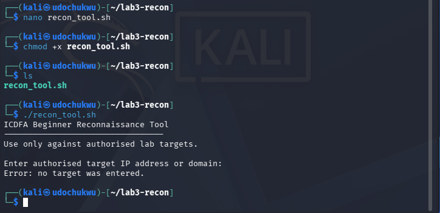
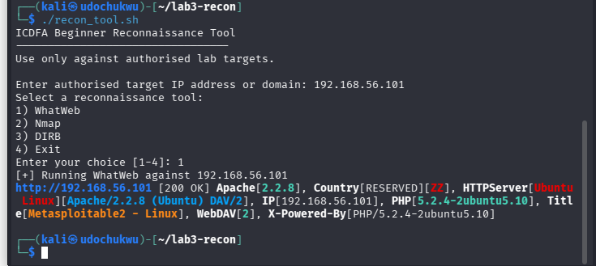
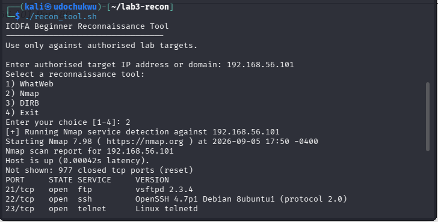
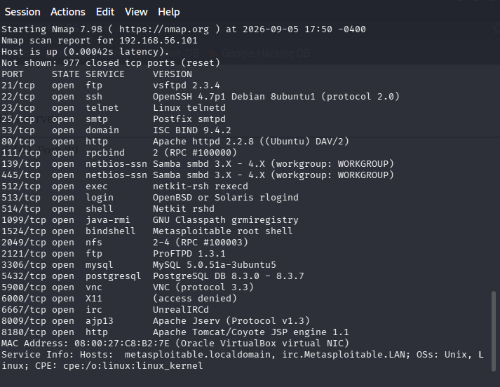
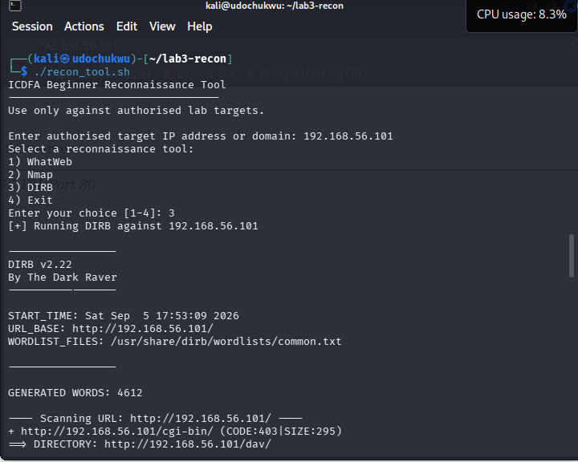
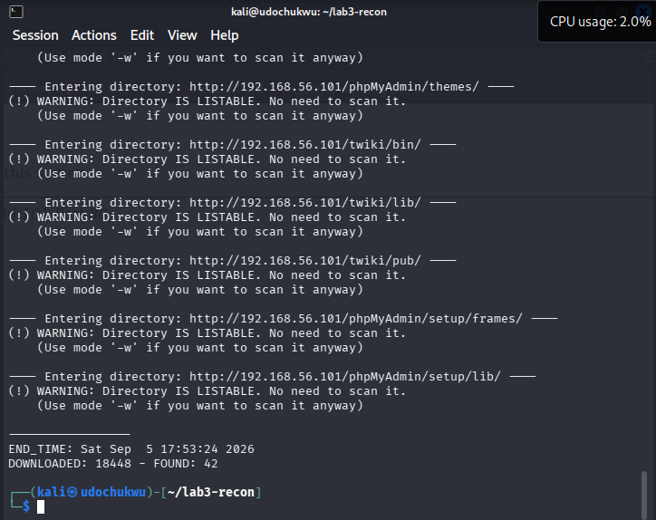

# Bash Reconnaissance Automation - Custom Multi-Tool Scanner

A custom-built **Bash automation tool** that wraps three separate reconnaissance utilities (WhatWeb, Nmap, DIRB) behind a single interactive, menu-driven interface — consolidating the manual multi-tool workflow from earlier labs into one reusable script with input validation and dependency checking.

> ⚠️ **Scope & Authorisation:** This script and its documented test runs were used exclusively against an instructor-authorised, isolated lab target (`192.168.56.101`, Metasploitable 2) on a private host-only network. The tool intentionally requires the operator to type in a target at runtime — no target is ever hardcoded — but that safeguard does not make scanning any system authorisation-optional. Do not run this script, or any like it, against systems you do not own or have explicit written permission to test.

---

## 🎯 Objective

Build a Bash script that:
- Prompts the operator for a target (never hardcoded)
- Validates that input before proceeding
- Presents a menu to choose between WhatWeb, Nmap, and DIRB
- Verifies each required tool is installed before attempting to run it
- Executes the chosen scan and displays output clearly
- Is properly packaged as an executable CLI utility

## 🧰 Environment & Tools

| Component | Detail |
|---|---|
| Interpreter | Bash (`#!/usr/bin/env bash`) |
| Attacker VM | Kali Linux |
| Target VM | Metasploitable 2 — `192.168.56.101` |
| Wrapped tools | `whatweb`, `nmap`, `dirb` |

## 🗂️ Repository Structure

```
lab3-report/
├── README.md
├── recon_tool.sh
└── screenshots/
    ├── 01-input-validation-empty-target-error.png
    ├── 02-recon-tool-whatweb-execution.png
    ├── 03-recon-tool-nmap-execution.png
    ├── 04-recon-tool-nmap-execution-continued.png
    ├── 05-recon-tool-dirb-execution.png
    └── 06-recon-tool-dirb-execution-continued.png
```

Screenshots are numbered in the order the corresponding test cases were run, with descriptive filenames so each image is self-explanatory in a GitHub repo browser.

> **Note:** File-transfer/zip packaging can strip the executable bit. After downloading, run `chmod +x recon_tool.sh` before executing it — this step is also demonstrated below as part of the build process.

---

## ⚙️ How It Works

```bash
chmod +x recon_tool.sh
./recon_tool.sh
```

The script then:

1. Prompts: `Enter authorised target IP address or domain:`
2. Validates the input — rejects an empty target and rejects any target containing whitespace
3. Presents a menu:
   ```
   Select a reconnaissance tool:
   1) WhatWeb
   2) Nmap
   3) DIRB
   4) Exit
   ```
4. Confirms the chosen tool is installed (`check_tool()`) before attempting to run it, failing gracefully with a clear error if it's missing
5. Runs the selected scan against the supplied target and prints the output directly to the terminal

### Core script logic

```bash
check_tool() {
    if ! command -v "$1" >/dev/null 2>&1; then
        echo "Error: required tool '$1' is not installed or not in PATH."
        exit 1
    fi
}

case "$choice" in
    1) check_tool whatweb; whatweb "http://$target" ;;
    2) check_tool nmap;    nmap -sV "$target" ;;
    3) check_tool dirb;    dirb "http://$target" ;;
    4) echo "Exiting. No scan was run."; exit 0 ;;
    *) echo "Error: invalid menu choice."; exit 1 ;;
esac
```

Full source: [`recon_tool.sh`](./recon_tool.sh)

---

## 🔍 Build & Verification Evidence

### Input Validation

Running the script with no target entered triggers the empty-input guard and exits cleanly with a clear error message rather than proceeding into the menu — verified before any scan logic was added.



### Test 1 — WhatWeb (Option 1)

Confirmed the script correctly wraps WhatWeb against the authorised target, returning the full technology fingerprint (Apache, PHP, WebDAV, etc.) in the terminal.



### Test 2 — Nmap (Option 2)

Confirmed the script correctly wraps `nmap -sV` against the authorised target, returning the full open-port and service-version inventory.




### Test 3 — DIRB (Option 3)

Confirmed the script correctly wraps DIRB against the authorised target, returning discovered directories and status codes — the third and final integrated tool, satisfying the "at least two tools execute successfully" requirement with room to spare.




---

## 💡 Key Skills Demonstrated

- Writing a portable, POSIX-friendly Bash script with a correct shebang and safe input handling (`read -rp`, quoted variable expansion)
- Defensive scripting: guarding against empty input and whitespace-containing targets before any scan logic runs
- Encapsulating repeated logic in a reusable function (`check_tool()`) to fail fast and clearly when a dependency is missing
- Building a `case`-driven CLI menu as a clean alternative to nested `if/elif` chains
- Wrapping and orchestrating three independent third-party security tools behind one consistent interface
- Understanding *why* hardcoding a target is bad practice, and enforcing that as a design constraint rather than a suggestion
- Packaging a script correctly for distribution (`chmod +x`, shebang, no hardcoded paths/targets)

---

## ⚖️ Disclaimer

This project was completed as part of a supervised cybersecurity training course, entirely within an isolated virtual lab. It is shared for portfolio/educational purposes to demonstrate practical Bash scripting and reconnaissance-automation methodology. None of the techniques described should be applied to any system without explicit, documented authorisation.

