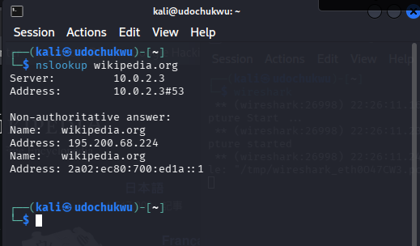
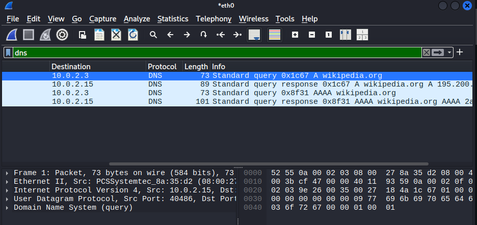
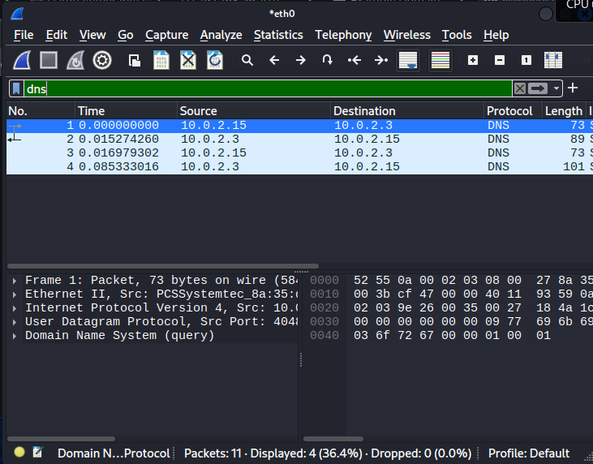
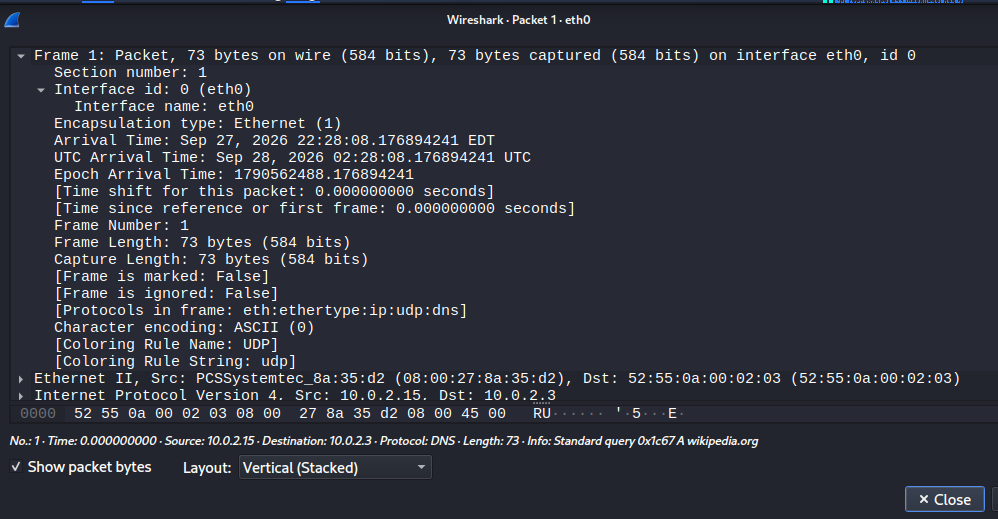
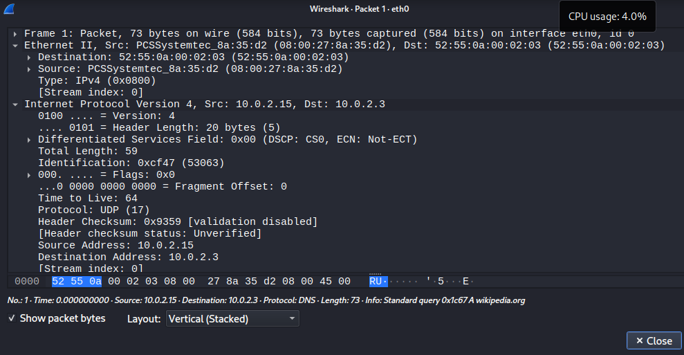
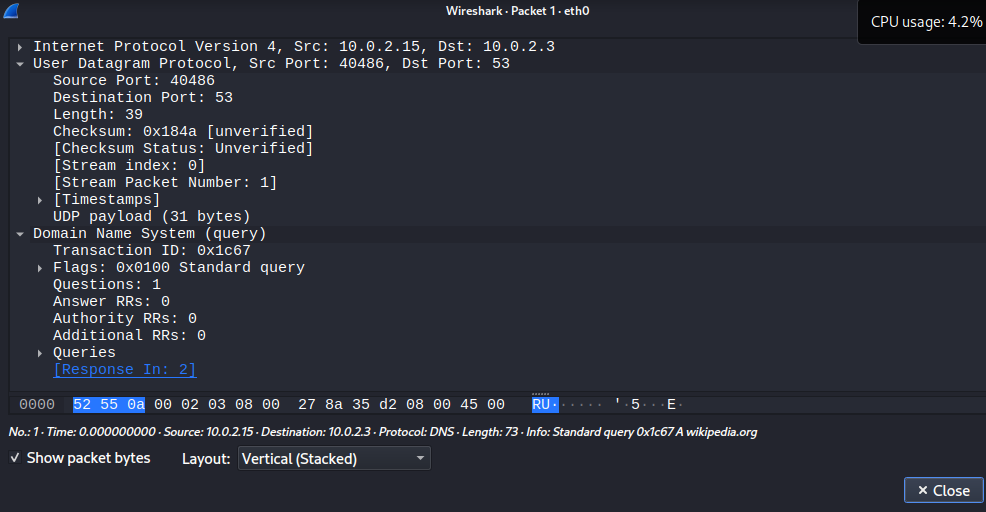
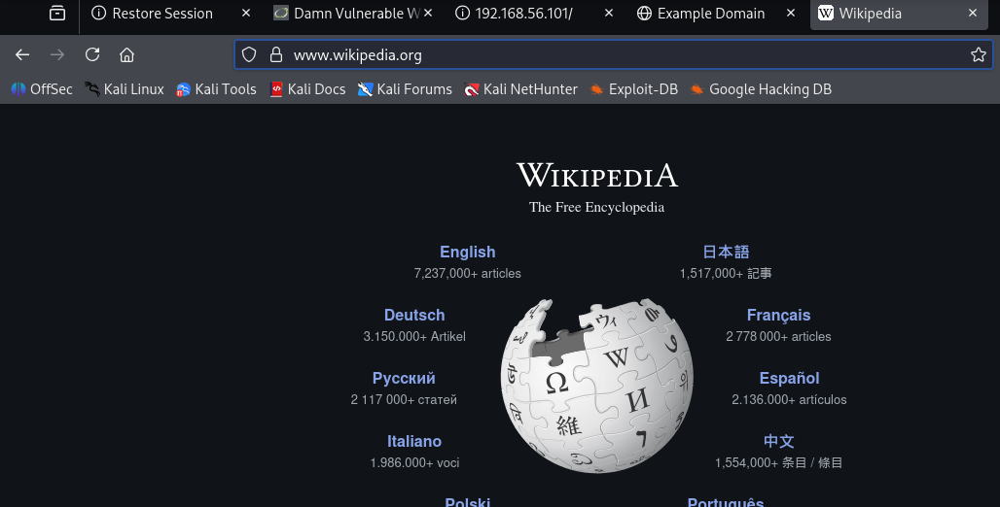
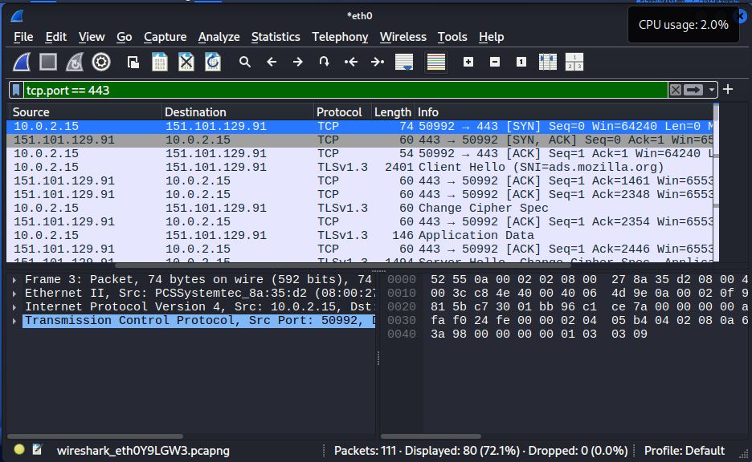
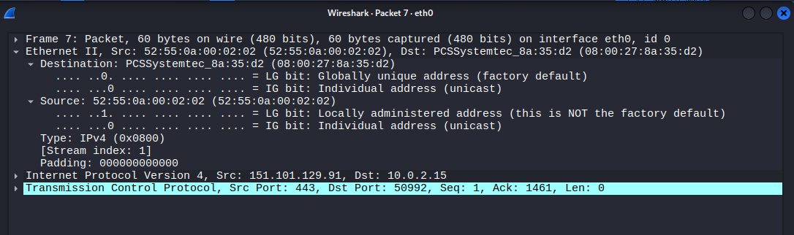
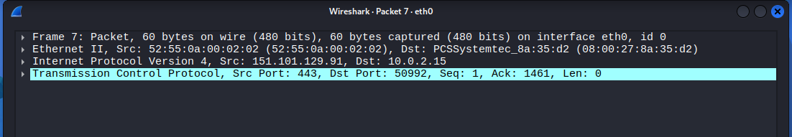

# Tracing a Secure Website Connection Through the TCP/IP Model

A packet-level investigation of how a device establishes a secure HTTPS connection to a website, captured and analysed live with **Wireshark**, and mapped against the four-layer TCP/IP model and its seven-layer OSI equivalent. Produced as a team networking-fundamentals project; this repository documents the technical investigation and evidence behind the team's presentation deliverable.

> 🎓 **Context:** Group assignment for a networking fundamentals module. The brief required selecting one real communication scenario, tracing it end-to-end through the TCP/IP model with live packet capture evidence, mapping it to the OSI model, comparing TCP and UDP, and diagnosing a realistic communication failure.

---

## 🎯 Scenario Selected: Opening a Secure Website

**Target:** `https://www.wikipedia.org`
**Capture tool:** Wireshark (interface `eth0`)
**Lab environment:** Kali Linux client (`10.0.2.15`) on a NAT network, default gateway/DNS resolver `10.0.2.3`

The goal was to capture and explain, with direct packet evidence, every protocol and layer involved in resolving a domain name and establishing an encrypted connection to it — from DNS resolution through to the TLS-protected HTTP exchange.

## 🗂️ Repository Structure

```
tcpip-project-report/
├── README.md
└── screenshots/
    ├── 01-nslookup-dns-resolution-wikipedia.png
    ├── 02-wireshark-dns-query-response-capture.png
    ├── 03-browser-https-wikipedia-loaded.png
    ├── 04-wireshark-dns-packet-list-detail.png
    ├── 05-wireshark-tcp-tls-handshake-port-443.png
    ├── 06-wireshark-packet-encapsulation-ethernet-ip-udp-dns.png
    ├── 07-wireshark-ethernet-ip-header-mac-ip-addressing.png
    ├── 08-wireshark-tcp-synack-port-443-header-detail.png
    ├── 09-wireshark-tcp-synack-port-summary.png
    └── 10-wireshark-udp-dns-query-port-53-detail.png
```

Screenshots are numbered in the order the investigation was performed and named descriptively so each image is self-explanatory in a GitHub repo browser.

---

## 🔍 Packet Journey: Step-by-Step Evidence

### 1. Application Layer — Name Resolution Request

Before any connection can be made, the hostname `wikipedia.org` must be resolved to an IP address. An `nslookup` query against the resolver confirms both the IPv4 (`195.200.68.224`) and IPv6 answers returned.



### 2. DNS Query/Response Captured Live in Wireshark

Filtering the live capture on `dns` isolates the exact request/response pair: a standard `A` query from the client (`10.0.2.15`) to the resolver (`10.0.2.3`), followed by the resolver's answer, then a second `AAAA` query/response pair for IPv6.




### 3. Full Protocol Encapsulation of the DNS Packet

Expanding Packet 1 in Wireshark shows the complete encapsulation stack Wireshark itself identifies: `eth:ethertype:ip:udp:dns` — i.e. the DNS query (Application layer) is wrapped inside a UDP segment (Transport layer), inside an IPv4 packet (Internet layer), inside an Ethernet II frame (Network Access layer). This is direct, first-hand evidence of TCP/IP encapsulation rather than a textbook diagram.



### 4. Addressing — MAC and IP Headers

Drilling into the Ethernet II and IPv4 headers of that same packet exposes both addressing layers at once: the **source/destination MAC addresses** (data-link addressing, local network only) and the **source/destination IP addresses** (`10.0.2.15` → `10.0.2.3`, logical addressing, routable end-to-end).



### 5. Transport Layer — UDP Port Numbers for DNS

The UDP header for the same query shows **source port 40486** (ephemeral, client-chosen) and **destination port 53** (well-known port for DNS) — demonstrating how port numbers identify the specific service and the specific client conversation.



### 6. Browser Loads the Resolved Site

With the IP address resolved, the browser successfully loads `https://www.wikipedia.org`, confirming the padlock/HTTPS indicator in the address bar.



### 7. Transport Layer — TCP Three-Way Handshake & TLS Handshake

Filtering on `tcp.port == 443` captures the full connection setup to the Wikipedia edge server (`151.101.129.91`):

1. **SYN** `10.0.2.15:50992 → 151.101.129.91:443`
2. **SYN, ACK** `151.101.129.91:443 → 10.0.2.15:50992`
3. **ACK** `10.0.2.15:50992 → 151.101.129.91:443`

— the classic TCP three-way handshake — immediately followed by the **TLS 1.3** handshake (`Client Hello`, `Server Hello`, `Change Cipher Spec`, encrypted `Application Data`), showing HTTPS traffic is fully encrypted at the application layer once the TCP connection is established.



### 8. Transport Layer — Port Numbers in the TCP Header

Inspecting the server's `SYN, ACK` reply (Packet 7) confirms **source port 443** (HTTPS, well-known port on the server) replying to **destination port 50992** (the client's ephemeral port) — the two together, combined with both IP addresses, uniquely identify this single TCP connection (the "socket pair").




---

## 🧱 TCP/IP-to-OSI Layer Mapping (as demonstrated)

| TCP/IP Layer | OSI Equivalent(s) | Protocols Observed in Capture | Evidence |
|---|---|---|---|
| Application | Application, Presentation, Session | DNS, HTTPS/TLS | Screens 1, 3, 5 |
| Transport | Transport | TCP (port 443), UDP (port 53) | Screens 5, 8, 9, 10 |
| Internet | Network | IPv4 (`10.0.2.15`, `10.0.2.3`, `151.101.129.91`) | Screens 6, 7 |
| Network Access | Data Link, Physical | Ethernet II (MAC addressing) | Screens 6, 7 |

## 📋 Protocol Analysis Summary

| Layer | Protocol | PDU | Addressing | Purpose Observed |
|---|---|---|---|---|
| Application | DNS | Message | Hostname → IP | Resolved `wikipedia.org` to `195.200.68.224` |
| Application | TLS 1.3 | Record | — (operates over the TCP stream) | Encrypted the HTTPS session after the handshake |
| Transport | UDP | Segment/Datagram | Port 40486 → Port 53 | Carried the DNS query/response (connectionless) |
| Transport | TCP | Segment | Port 50992 → Port 443 | Established a reliable, ordered connection before any HTTPS data was sent |
| Internet | IPv4 | Packet | `10.0.2.15` → `151.101.129.91` | Routed the connection between client and the Wikipedia edge server |
| Network Access | Ethernet II | Frame | MAC → MAC | Delivered frames across the local network segment |

## ⚖️ TCP vs UDP (as evidenced in this capture)

| | **TCP** | **UDP** |
|---|---|---|
| Connection | Connection-oriented — three-way handshake observed before any data | Connectionless — no handshake before the DNS query |
| Reliability | Acknowledged, ordered, retransmits on loss | No acknowledgment or retransmission |
| Overhead | Higher (handshake + acks) | Lower (fire-and-forget) |
| Used here for | HTTPS (port 443) — needs guaranteed, ordered delivery of a web page | DNS (port 53) — a single small query/response, speed matters more than guaranteed delivery |
| Other typical applications | Email (SMTP/IMAP), file transfer (FTP) | Video conferencing, VoIP, live video streaming |

---

## 🛠️ Communication Failure & Troubleshooting

**Scenario demonstrated:** A device has fully working IP connectivity (it can resolve DNS and ping the server) but `https://www.wikipedia.org` still fails to load, because **outbound TCP port 443 is blocked** by a firewall rule.

**Structured troubleshooting approach:**

1. **Verify Layer 3 connectivity** — `ping` the resolved IP to confirm routing works (IP layer is healthy).
2. **Verify name resolution** — confirm `nslookup`/`dig` returns a valid A/AAAA record (Application-layer DNS is healthy).
3. **Isolate the transport layer** — attempt a direct TCP connection to port 443 (e.g. `telnet <ip> 443` or `Test-NetConnection -Port 443`); if this hangs or is refused while ICMP succeeds, the fault is isolated specifically to TCP port 443, not general connectivity.
4. **Capture traffic with Wireshark** — confirm the client sends a `SYN` but never receives a `SYN, ACK`, which is the packet-level signature of a blocked or filtered port (as opposed to a server-side problem, which would typically show a `RST`).
5. **Check the firewall rule set** — identify the rule silently dropping outbound/inbound traffic on port 443.
6. **Resolve** — correct the firewall rule to permit TCP/443, then re-test with the same handshake capture to confirm the `SYN → SYN,ACK → ACK` sequence now completes.

This mirrors exactly the working handshake captured in Screenshot 5 above — that successful three-way handshake is the "known-good" baseline this troubleshooting method compares against when a failure is suspected.

---

## 💡 Key Skills Demonstrated

- Capturing and filtering live network traffic with Wireshark (`dns`, `tcp.port == 443`)
- Reading and explaining full packet encapsulation across all four TCP/IP layers from raw hex/header data
- Distinguishing MAC addressing (local, Data Link) from IP addressing (end-to-end, Network)
- Explaining the TCP three-way handshake and TLS handshake from direct packet evidence, not theory
- Mapping observed, real traffic to the TCP/IP and OSI models rather than reciting them in the abstract
- Comparing TCP and UDP behaviour using two protocols captured in the same session (HTTPS vs DNS)
- Applying a structured, layer-by-layer troubleshooting method to a specific simulated failure (blocked port 443)

---

## 📌 Individual Contribution Note

Within the team submission, this contributor's documented role covered the **Wireshark packet capture and analysis** (DNS, TCP, and TLS traffic) together with research supporting the **TCP/IP-to-OSI model mapping** used in the team's final presentation.

---

## ⚖️ Disclaimer

This investigation was carried out as part of a supervised networking fundamentals group assignment, using the author's own lab device and public DNS/web traffic to `wikipedia.org`. It is shared for portfolio/educational purposes to demonstrate packet-level understanding of the TCP/IP model. No unauthorised interception of third-party traffic was performed.
